# 幻燈 GENTO

幻燈は、素材ひとつからコードだけでショート動画を作る Claude Code スキルです。

幻燈是一个 Claude Code skill：给一段素材，用代码做出带配乐的动画短片。

GENTO is a Claude Code skill that turns a brief into a short animated film with its own soundtrack. Every frame is drawn on a canvas and every note is synthesized in code; there is no audio sample. Films can be pure motion graphics, or built around public-domain artworks (museum statues, paintings) that GENTO cuts out, color-grades and moves a camera across. Type `/gento` plus your brief, answer a few multiple-choice questions, and an MP4 lands on your desktop.

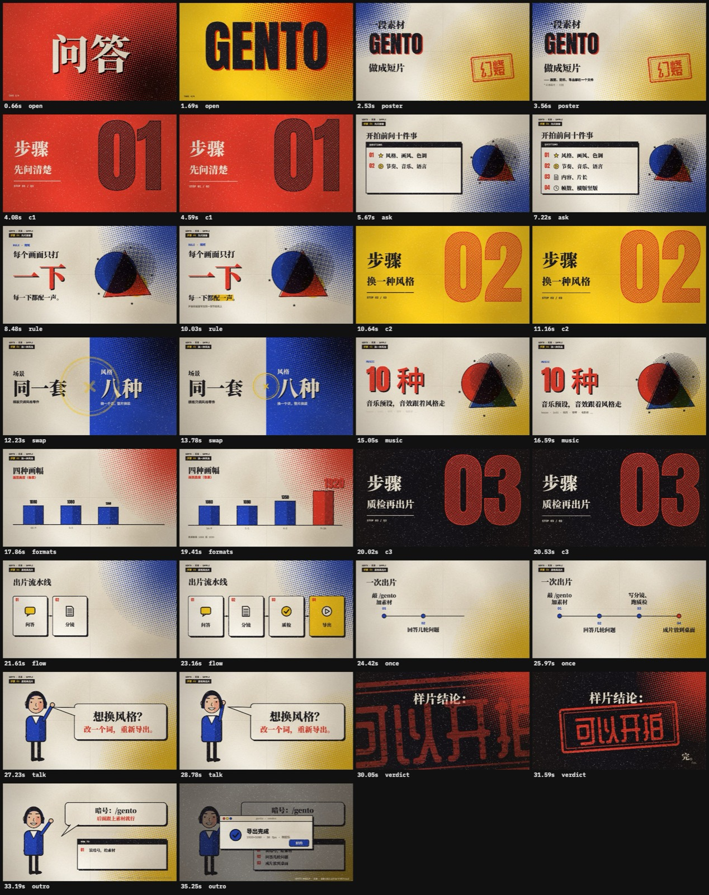

## Styles

Nine style packs. Every scene template works in every style, format and language.

| Style | Look | Default music |
|---|---|---|
| `riso` 孔版 | Risograph poster: four inks on paper, halftone, misregistration, rubber stamps | house 128 |
| `swiss` 瑞士网格 | International typographic style: grid, grotesque type, one accent colour | minimal 112 |
| `glitch` 故障霓虹 | Neon on black, scanlines, RGB split, slice glitches | cyber 124 |
| `woodblock` 木版浮世绘 | Washi, indigo and vermilion, bokashi skies, seigaiha waves, seal stamps | wafu 96 |
| `blueprint` 蓝图工程 | White lines on blue, drawing frame, dimension lines, gears drawn stroke by stroke | minimal 112 |
| `industrial` 工业渲染 | Studio-lit product render, brushed metal, turntable, exploded view, callouts | cinematic 100 |
| `serene` 岁月静好 | Warm light, film grain, dust, text drifting in from a blur | piano 72 |
| `explainer` 讲故事 | Flat illustration: bouncy shapes, icons, arrows, iris transitions | bright 108 |
| `amphora` 希腊陶瓶 | Black- and red-figure pottery or marble: meander borders, laurels, Roman capitals, column bar charts | lyre 96 |

| | | |
|---|---|---|
| 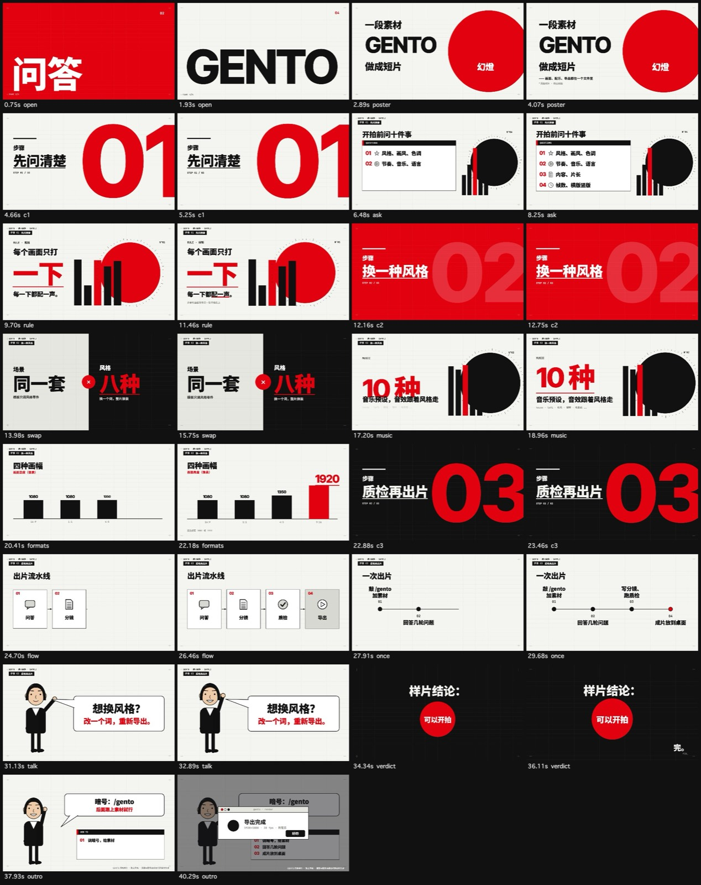 | 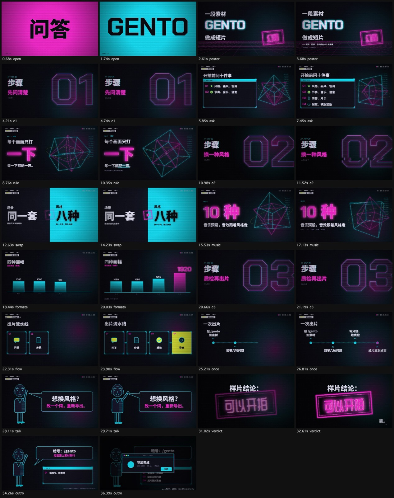 | 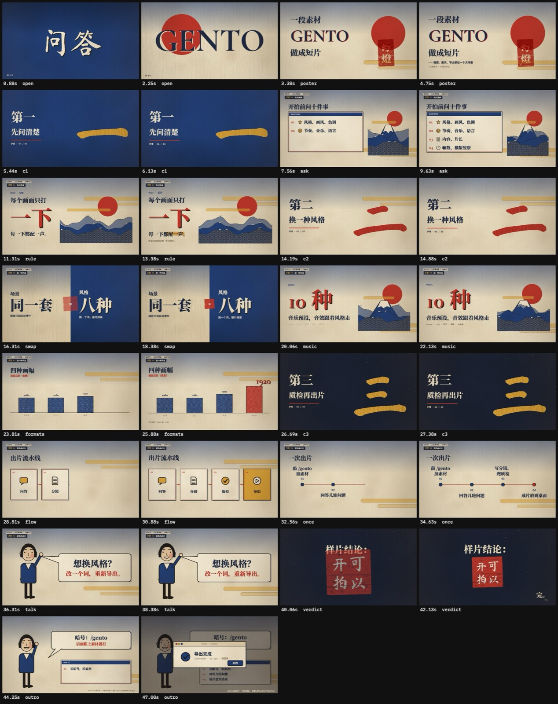 |
| 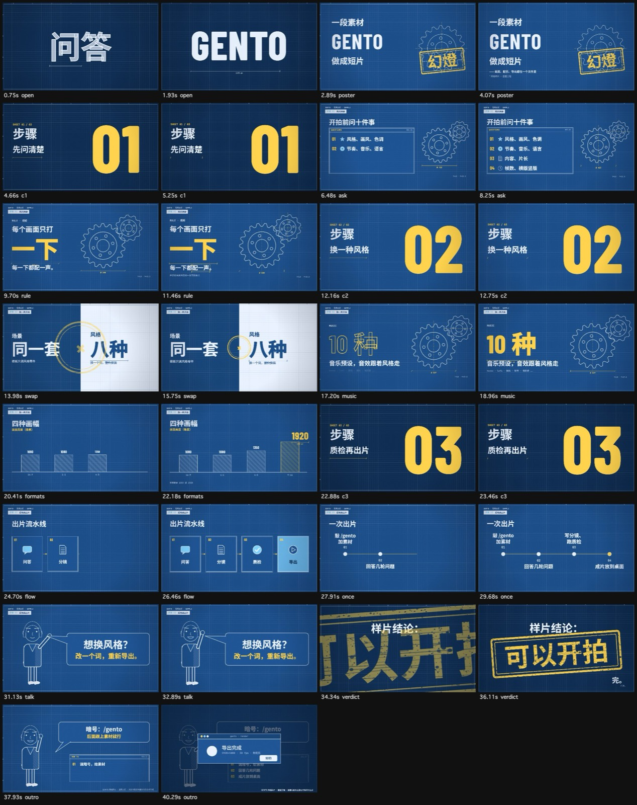 | 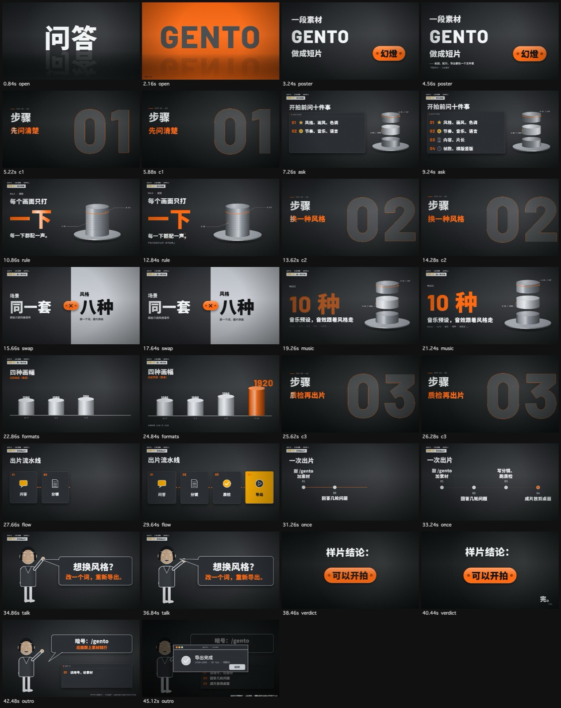 | 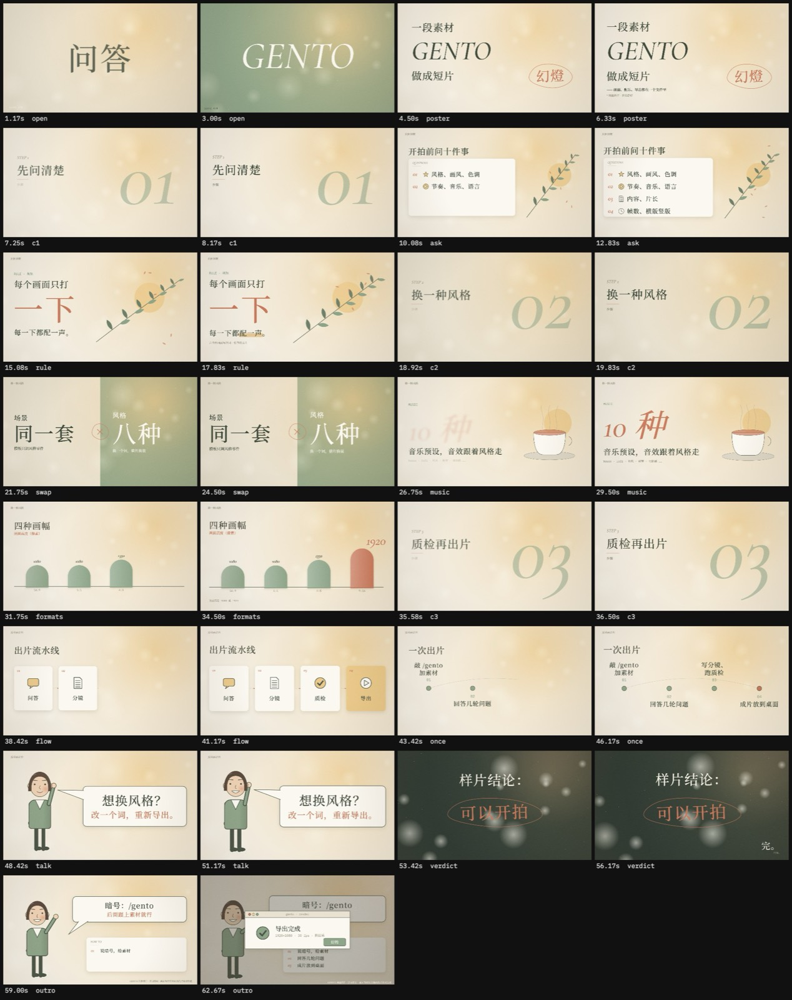 |
| 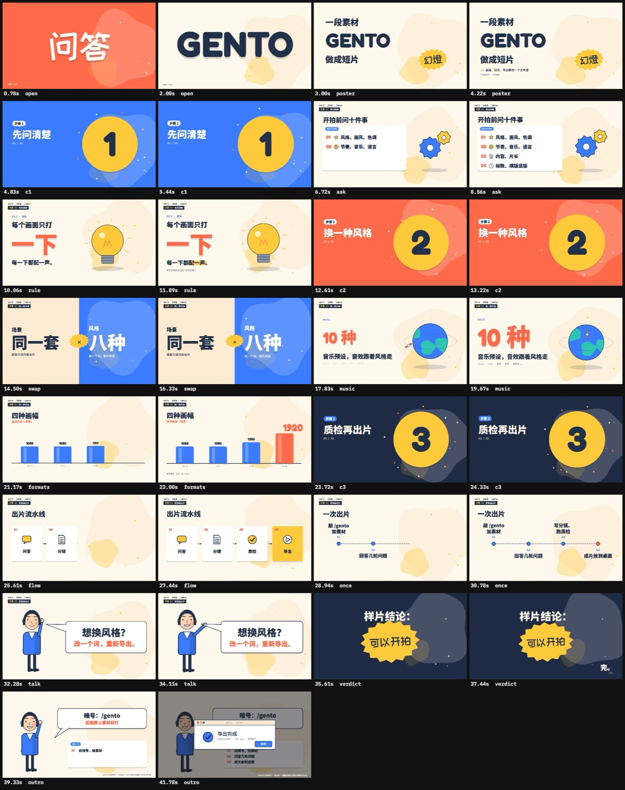 | 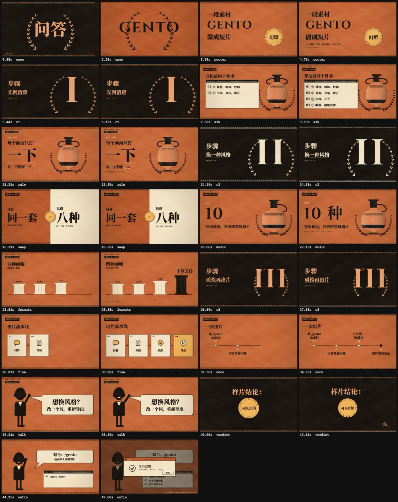 | 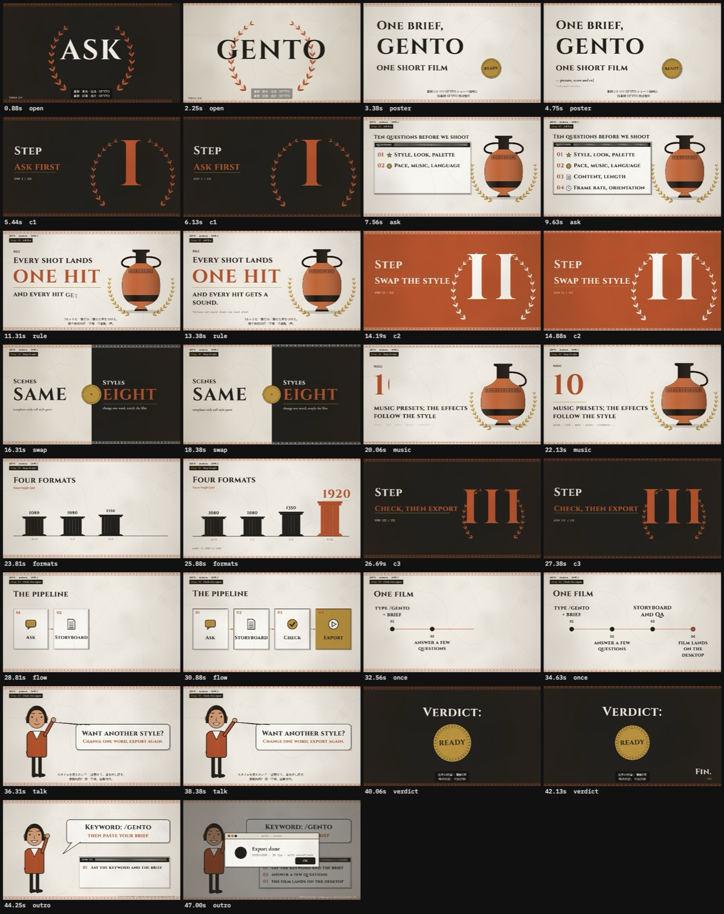 |
| 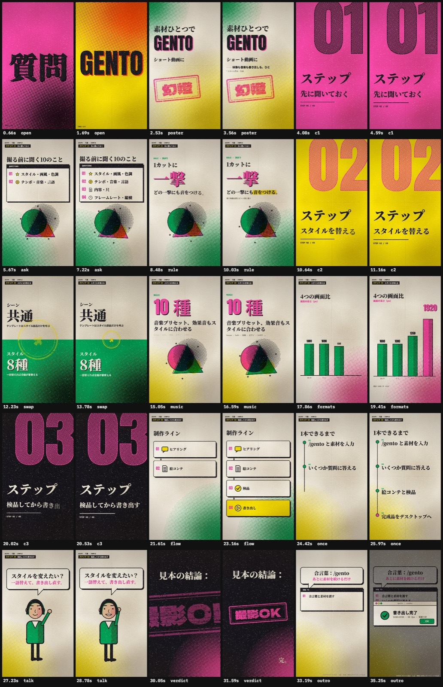 | 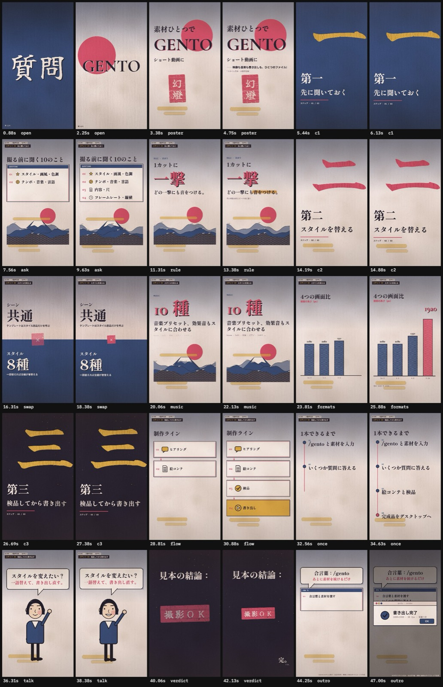 | 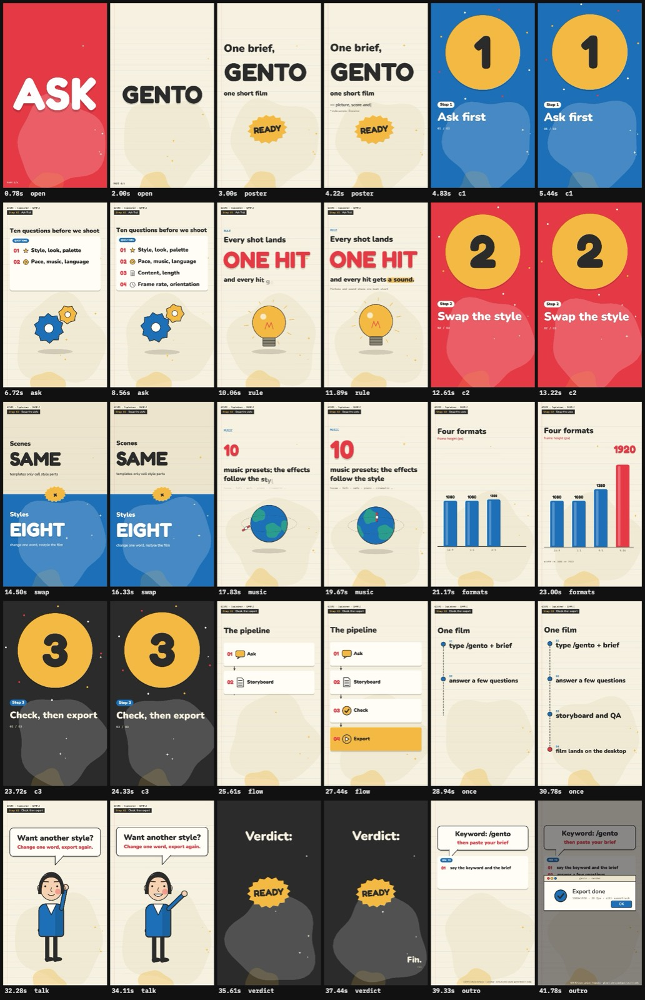 |

Scene templates for artwork: `T.statue` (a cut-out statue standing in front of a giant word, with a blurred painting behind it for depth), `T.plate` (a full-bleed painting with a camera path and a light sweep), `T.montage` (beat-synced cuts) and `T.credits` (thumbnails plus sources). `scripts/fetch_art.py` searches open museum collections and Wikimedia Commons, accepts only CC0 and public-domain files and records the source of each one; `scripts/prep_art.py` cuts out and color-grades the images. See `samples/greek-myth`.

For longer films there are `T.void` (a glowing title over particles), `T.tree` (a family tree that grows node by node with an automatic camera), `T.trio` (three works side by side) and `T.pantheon` (a wall of portrait medallions), four scene transitions (ink, shatter, sand, zoom) and seven particle and light effects (dust, light rays, stars, vortex, embers or falling gold, water shimmer, lightning). See `samples/greek-genealogy`.

Formats: 16:9, 9:16, 1:1, 4:5. Languages: Chinese, Japanese, English, three languages set side by side, or one main language with the other two as subtitles. Frame rates: 24, 30, 60.

## Install

Requirements: macOS or Linux, Node 18+, Google Chrome, ffmpeg, and an internet connection for Google Fonts.

**As a personal skill** (short command `/gento`):

```bash
git clone https://github.com/Shinkou777/gento.git
cd gento
bash install.sh
```

The installer links `skills/gento` into `~/.claude/skills/gento`, installs `puppeteer-core`, checks for Chrome and ffmpeg, and runs a smoke test. `git pull` updates the skill in place.

**As a plugin** (any machine, invoked as `/gento:gento`):

```
/plugin marketplace add Shinkou777/gento
/plugin install gento@shinkolab
```

## Use

```
/gento Q3 results: revenue up 18%, three new markets, hiring freeze lifted. Vertical, 30 seconds.
```

GENTO reads what you already specified and asks the rest in up to three rounds: style, look, format, language, palette, pace, music, length, frame rate, and how freely it may rewrite your text. Then it writes a storyboard, runs the automated QA, renders, and opens the output folder:

```
~/Desktop/幻燈/<slug>/
  <title>.mp4          H.264 + AAC
  <title>.html         self-contained, plays in a browser with sound
  <title>-sheet.jpg    contact sheet, two frames per scene
```

To restyle, change one field in `film.json` (style, palette, format, music) and render again. Scenes are templates, so nothing else needs rewriting.

## How it works

- **One clock.** Everything sits on the music's beat grid. Scenes are laid out in bars; each template schedules its picture, its sound effects and its camera hits against the same start time, so they cannot drift apart.
- **Pure frames.** `renderAt(t)` draws any moment from `t` alone with seeded randomness, so playback, scrubbing and export produce identical frames.
- **Style packs.** A style is a palette set, a font set per language and a small set of components (background, post-processing, title, hit, seal, marker, panel, caption, word card, chapter card, HUD, ornament). Scene templates call only these components.
- **Synthesized score.** Eleven music presets built from small instruments (kick, clap, 808, pads, e-piano, piano, marimba, koto, taiko, metal hits, a Karplus-Strong plucked lyre) with sidechain, a hand-written reverb and a soft clipper. Scenes ask for semantic sounds (`hit`, `seal`, `pop`, `ding`) and the preset decides the timbre.
- **Build.** `film.json` + `film.js` + engine + the chosen style are concatenated into one HTML file.
- **Export.** Headless Chrome renders every frame, ffmpeg muxes it with the synthesized WAV.
- **QA.** `scripts/check.js` fails the build on missing fonts, text outside the frame, overlapping text, hits without a sound and clipping audio, and warns on large empty areas, tiny text and silent gaps. `scripts/test.js --matrix` runs every style across formats and languages.

## Extend

Add a style pack, a music preset or a scene template by following [`skills/gento/references/extend.md`](skills/gento/references/extend.md). The regression suite must pass before a change ships.

## Credits

The engine grew out of [dario-shabi](https://github.com/Darren-Ter/dario-shabi) by Darren Ter (MIT): the single-file canvas film, the beat-grid timeline, the riso look and the offline synthesizer. See [THIRD_PARTY_NOTICES.md](THIRD_PARTY_NOTICES.md).

## License

[MIT](LICENSE) © 2026 @先進元素
